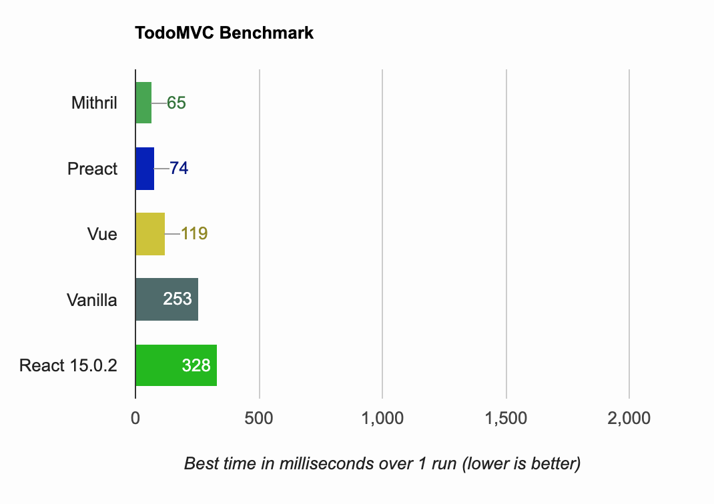
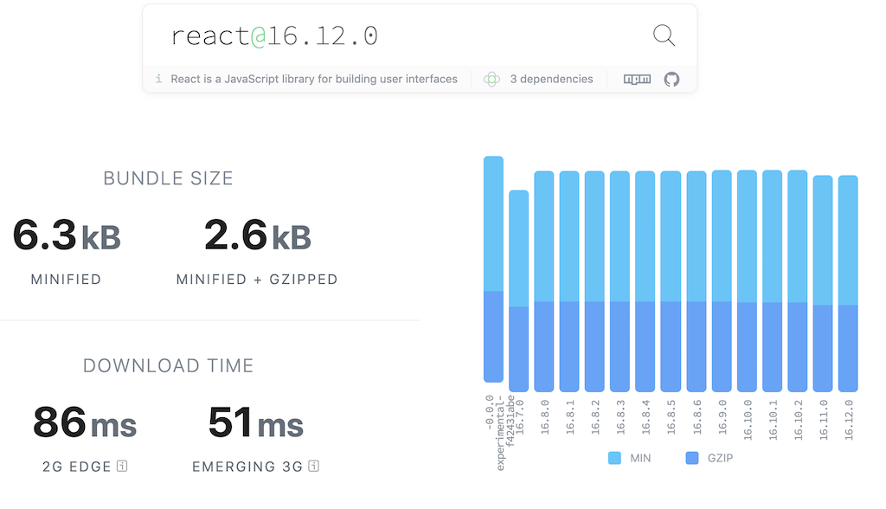
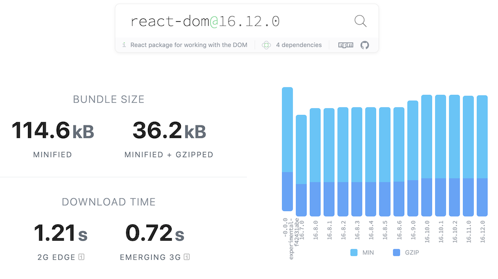

# TLDR - PreactJS

Read the [TDLR - React](https://github.com/sc0ttj/tldr-react) README first.

## Contents:

- [Class component](#class-component)
- [Preact vs React](#preact-vs-react)
- [Performance comparisons](#performance-comparisons)
- [Using Preact](#using-preact)
- [Using Preact in palce of React](#using-preact-in-place-of-react)
- [Preact addons](#preact-addons)
- [Further reading](#further-reading)

## Class component

```js
import { h, render, Component } from 'preact';

/** @jsx preact.h */

class Clock extends Component {
    constructor() {
        super();
        // set initial time:
        this.state = {
            time: Date.now()
        };
    }

    // Preact supports all the same lifecycle methods as React...

    componentDidMount() {
        // update time every second
        this.timer = setInterval(() => {
            this.setState({ time: Date.now() });
        }, 1000);
    }

    componentWillUnmount() {
        // stop when not renderable
        clearInterval(this.timer);
    }

    render(props, state) {
        let time = new Date(state.time).toLocaleTimeString();
        return <span>{ time }</span>;
    }
}

// render an instance of Clock into <body>:
render(<Clock />, document.body);
```

## Preact vs React

There are many differences between React and Preact that we can summarize in three points:

- **Features and API**: Preact includes only a subset of the React API, and not all available features in React.
- **Size**: Preact is much smaller than React.
- **Performance**: Preact is faster than React.


Notable differences in Preact:

- components have a `render()` method like React, but _unlike_ React this method is passed `(props, state)` as arguments.
- no support for React `propTypes`


## Performance comparisons

### Performance benchmarks

<p align="center">
    
</p>
<p align="center">From https://developit.github.io/preact-perf/<p>

### Bundle size: React and React DOM

<p align="center">
    
    
</p>

### Bundle size: Preact

<p align="center">
    
</p>

## Using Preact

Install it:

```console
$ npm i preact preact-compat
```

Add it to your projects JS files:

```javascript
import { h, render, Component } from 'preact';

// Tell Babel to transform JSX into preact.h() calls:
/** @jsx preact.h */

class MyComponent extends Component {
    ...
}

// render an instance of MyComponent into <body>:
render(<MyComponent />, document.body);
````

Instead of declaring the `@jsx` pragma in your code (above, under imports),
it's best to configure it globally in a `.babelrc`:

For Babel 5 and prior:

```
{ "jsxPragma": "h" }
````

For Babel 6:

```
{
  "plugins": [
    ["transform-react-jsx", { "pragma":"h" }]
  ]
}
```

For Babel 7:

```
{
  "plugins": [
    ["@babel/plugin-transform-react-jsx", { "pragma":"h" }]
  ]
}
```

## Using Preact in place of React

Uninstall React, and install Preact:

```console
$ npm uninstall react react-dom
$ npm install preact preact-compat
```

Let `webpack` know that when we say 'react', we mean 'preact':

In your webpack config:

```javascript
config.resolve.alias['react'] = 'preact-compat';
config.resolve.alias['react-dom'] = 'preact-compat';
```

## Preact addons

See https://www.npmjs.com/package/preact#libraries--add-ons

